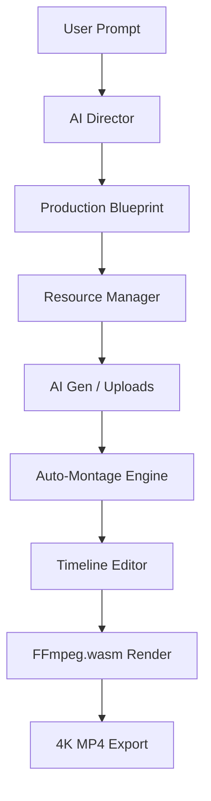

# 🎬 Release Cut — AI Video Production Studio


[](https://nextjs.org/)
[](https://react.dev/)
[](https://www.typescriptlang.org/)
[](https://tailwindcss.com/)
[](https://opensource.org/licenses/MIT)

**Release Cut** — это полноценная браузерная студия видеопроизводства, работающая на базе искусственного интеллекта. В отличие от простых редакторов, MONTIQ автоматизирует весь цикл: от идеи и написания сценария до финального рендеринга в 4K с использованием передовых техник монтажа и VFX.

---

## 🚀 Основные возможности

### 🧠 AI Director 2.0 (Режиссёрский Интеллект)
Центральный мозг системы, который не просто «клеит» видео, а планирует его как профессионал с 20-летним опытом.
*   **Стратегический анализ**: Определение целей (конверсия, охваты), аудитории и платформы (TikTok, YouTube, TV).
*   **Драматургия**: Построение Story Arc, создание Hook, планирование Payoff и удержания внимания (Retention).
*   **Профессиональные техники**: Автоматическое планирование J-cuts, L-cuts, Match cuts и B-roll перебивок.
*   **Production Blueprint**: Генерация подробного режиссёрского плана до начала монтажа.

### ✂️ Профессиональный Редактор
Полноценный нелинейный видеоредактор (NLE) прямо в вашем браузере.
*   **Multi-track Timeline**: Неограниченное количество дорожек видео, аудио, текста и оверлеев.
*   **Keyframe Animation**: Полный контроль над всеми параметрами (позиция, масштаб, прозрачность, эффекты) через ключевые кадры.
*   **Picture Lock**: Интеллектуальная система контроля качества, исправляющая ритмические ошибки и «дыры» в монтаже.
*   **Smart Auto-Framing**: Автоматическое отслеживание лиц (Face Detection) для идеального кадрирования в вертикальных форматах.

### ✨ VFX & Motion Graphics
Библиотека эффектов и графики профессионального уровня.
*   **25+ Эффектов**: Glitch, VHS, Chromatic Aberration, Blur (Gaussian/Motion/Radial), Distortion и многие другие.
*   **12 Типов Motion Graphics**: Титры, Lower Thirds, Callouts, Progress Bars и Intro/Outro — всё полностью настраиваемое.
*   **Kinetic Typography**: Анимированные субтитры в стиле Hormozi и MrBeast с физикой движения (Elastic, Bounce, Stomp).
*   **Color Grading**: Поддержка LUT-пресетов (Cinematic, Vintage, Moody) и расширенные настройки цветокоррекции.

### 🎵 Звук и Музыка
*   **Audio Mastering**: Встроенный 3-полосный EQ, компрессор и система шумоподавления.
*   **Beat Sync**: Автоматическая синхронизация монтажных склеек с ритмом музыки.
*   **Algorithmic Music**: Генерация фоновой музыки и звуковых эффектов (Whoosh, Hit, Riser) на лету.

### 🎥 Генерация контента
*   **Text-to-Video**: Создание видеоклипов с нуля через Pollinations.AI (модель Seedance).
*   **Infinite Stock**: Если видео сгенерировать невозможно, система автоматически создаёт AI-изображения и добавляет им динамику движения камеры.

---

## 🛠 Технологический стек

| Слой | Технологии |
| :--- | :--- |
| **Framework** | Next.js 16.2 (App Router), React 19 |
| **Language** | TypeScript 5.9 |
| **Styles** | Tailwind CSS 4.1 |
| **State** | Zustand 5.0 |
| **Video Engine** | FFmpeg.wasm 0.12, libav.js |
| **AI Models** | OpenRouter (LLaMA 3), Groq, Pollinations.AI |
| **Computer Vision** | MediaPipe (Face Detection) |
| **Storage** | IndexedDB (idb) |

---

## 📦 Быстрый старт

### Требования
*   Node.js 20+
*   Браузер с поддержкой SharedArrayBuffer (Chrome, Edge, Firefox)

### Установка
1. Клонируйте репозиторий:
   ```bash
   git clone https://github.com/zaharzelenkev/moontiq--ai-video-studio.git
   cd moontiq--ai-video-studio
   ```

2. Установите зависимости:
   ```bash
   npm install
   ```

3. Настройте переменные окружения (создайте `.env.local`):
   ```env
   OPENROUTER_API_KEY=your_key_here
   GROQ_API_KEY=your_key_here
   POLLINATIONS_API_KEY=your_key_here
   ```

4. Запустите сервер разработки:
   ```bash
   npm run dev
   ```

5. Откройте [http://localhost:3000](http://localhost:3000)

---

## 🏗 Архитектура системы



*   **Brain (`src/lib/brain`)**: Логика принятия режиссёрских решений.
*   **Editor (`src/components/editor`)**: UI-компоненты профессионального таймлайна.
*   **Engine (`src/lib/render.ts`)**: Мост между React-стейтом и FFmpeg командами.
*   **VFX (`src/lib/editor/vfxEngine.ts`)**: Рендеринг эффектов в реальном времени.

---

## 📈 Последние обновления (v2.0.0)

*   ✅ **Deep Strategic Analysis**: Режиссёр теперь учитывает психологию удержания аудитории.
*   ✅ **Stability 4K**: Исправлены ошибки памяти при рендеринге тяжёлых проектов.
*   ✅ **Motion Graphics Panel**: Полностью переработан интерфейс работы с графикой.
*   ✅ **Success Page**: Интеллектуальный дашборд после завершения генерации.

---

## 🎯 Планы развития
*   [ ] Автоматические субтитры через Whisper API.
*   [ ] Система Undo/Redo на таймлайне.
*   [ ] Коллаборативный монтаж в реальном времени.
*   [ ] Мобильное приложение на React Native.

---

## 📞 Поддержка и обратная связь

Если у вас есть вопросы или предложения, свяжитесь с нами напрямую.

Сделано с ❤️ командой **Release Cut**
